# Multi-Language-Quiz

## 📌 Description
The Multi-Language Quiz App is an interactive, browser-based quiz game built with HTML, CSS, JavaScript, jQuery, and Bootstrap. It allows users to test their knowledge across multiple categories, difficulty levels, and question counts while enjoying real-time language translation and dynamic gameplay features.

The app transforms standard trivia questions into an engaging experience with timers, lifelines, scoring analytics, answer review, and a persistent leaderboard powered by LocalStorage.

## 🛠 Prerequisites

To run this project, you only need:
* 🌐 A modern web browser (Chrome, Edge, Firefox, Safari)
  
## 📋 Features
Quiz Gameplay
* Questions fetched from OpenTDB API
* Multiple categories (Science, History, Sports, Music, etc.)
* Difficulty levels: Easy, Medium, Hard
* Custom question count (5–20 questions)
* Real-time scoring system

Multi-Language Support
* Live translation using MyMemory API

Supported languages:
* English 🇬🇧
* Spanish 🇪🇸
* French 🇫🇷
* German 🇩🇪
* Italian 🇮🇹
* Portuguese 🇵🇹

## 💻 Technologies Used
The application is built with the following technologies:
* HTML
* CSS
* JavaScript
* jQuery
* Bootstrap
* Canvas Confetti
* LocalStorage
* REST APIs (OpenTDB + MyMemory Translation API)

## 🚀 Installation
No installation is required to use the app. It is hosted online and can be accessed via a web browser.

## 📚 Usage
1. Open the application in your browser.
2. Enter your player name
3. Select:
* Category
* Language
* Difficulty
* Number of questions
4. Click 🚀 Start Quiz
5. Answer questions before the timer expires
6. Use lifeline (50/50) if needed
7. View results and analytics
8. Check leaderboard rankings

## 🔗 Live Demo & Repository
Application can be viewed here: 
* 🌐 Live: https://yvonnesarah.github.io/Multi-Language-Quiz/
* 💻 Repository: https://github.com/yvonnesarah/https://github.com/yvonnesarah/Multi-Language-Quiz

## 🖼 Screenshot(S)
Before Design

Multi-Language Quiz - Modal

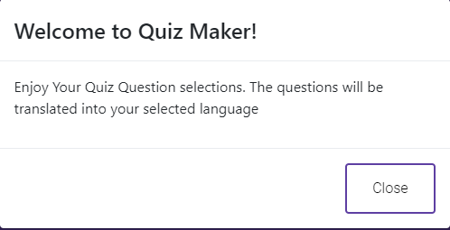

Multi-Language Quiz - Home

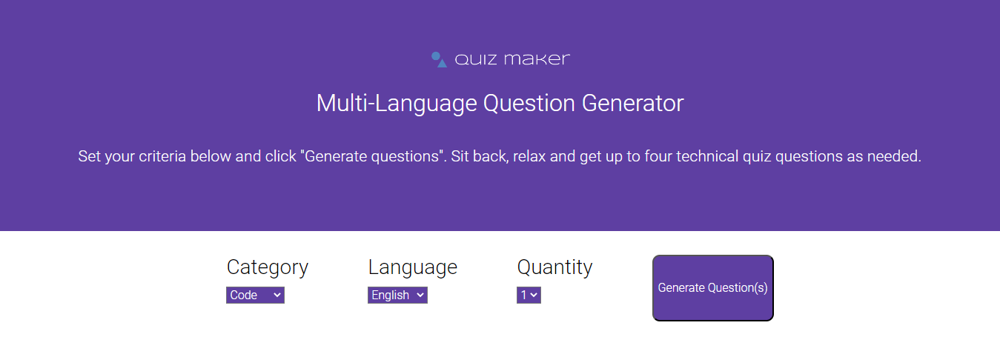

Multi-Language Quiz - Results - English

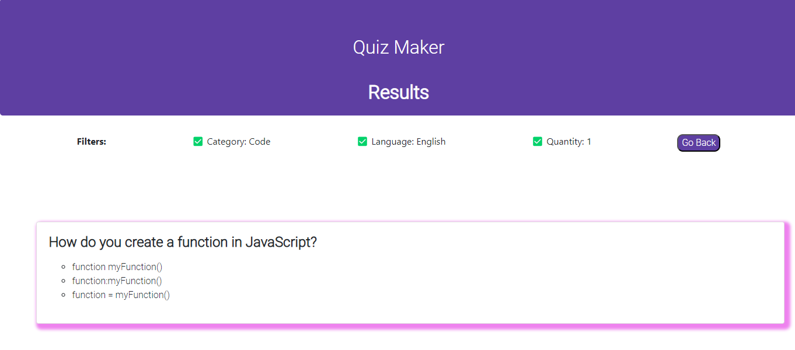

Multi-Language Quiz - Results - Spanish

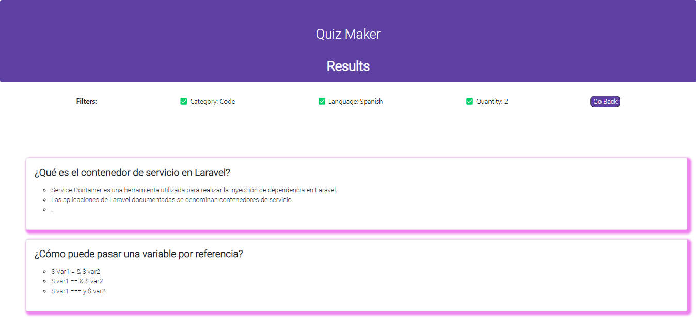

After Design

Multi-Language Quiz - Modal

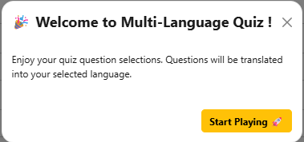

Multi-Language Quiz - Home

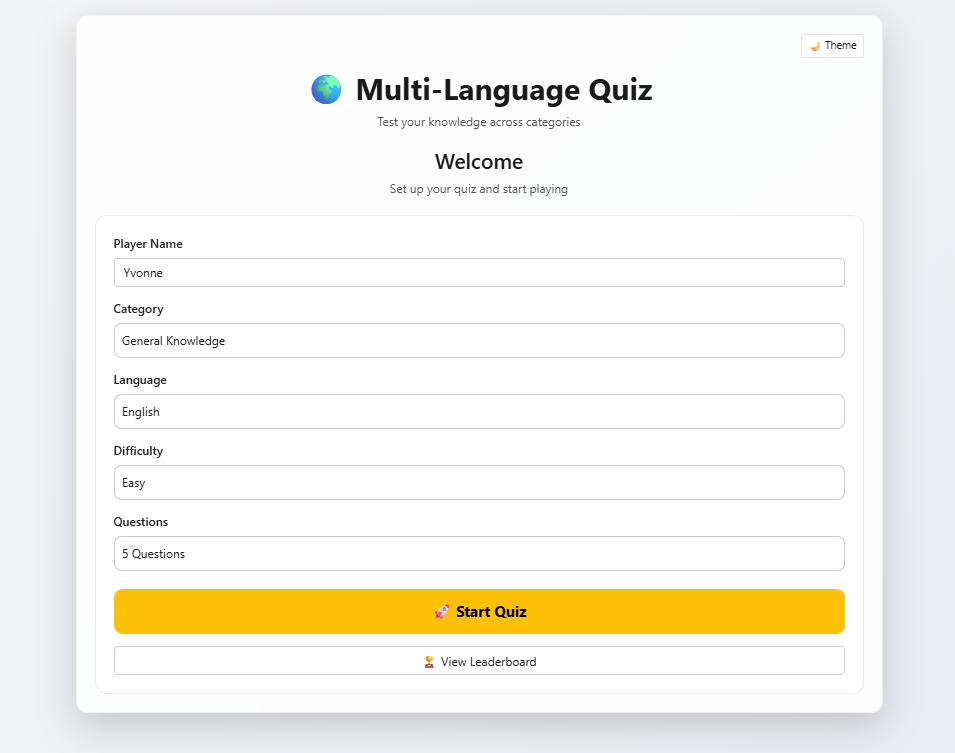

Multi-Language Quiz - Home - Dark Theme

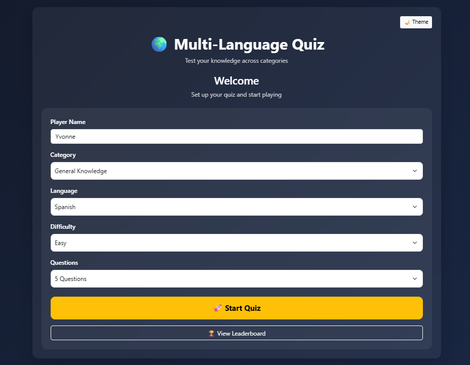

Multi-Language Quiz - Example Layout

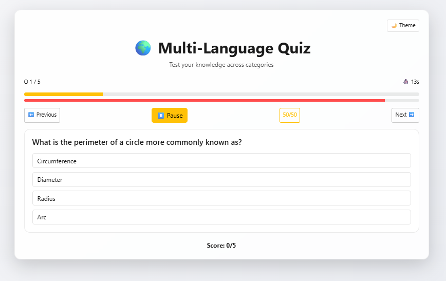

Multi-Language Quiz - Results - English

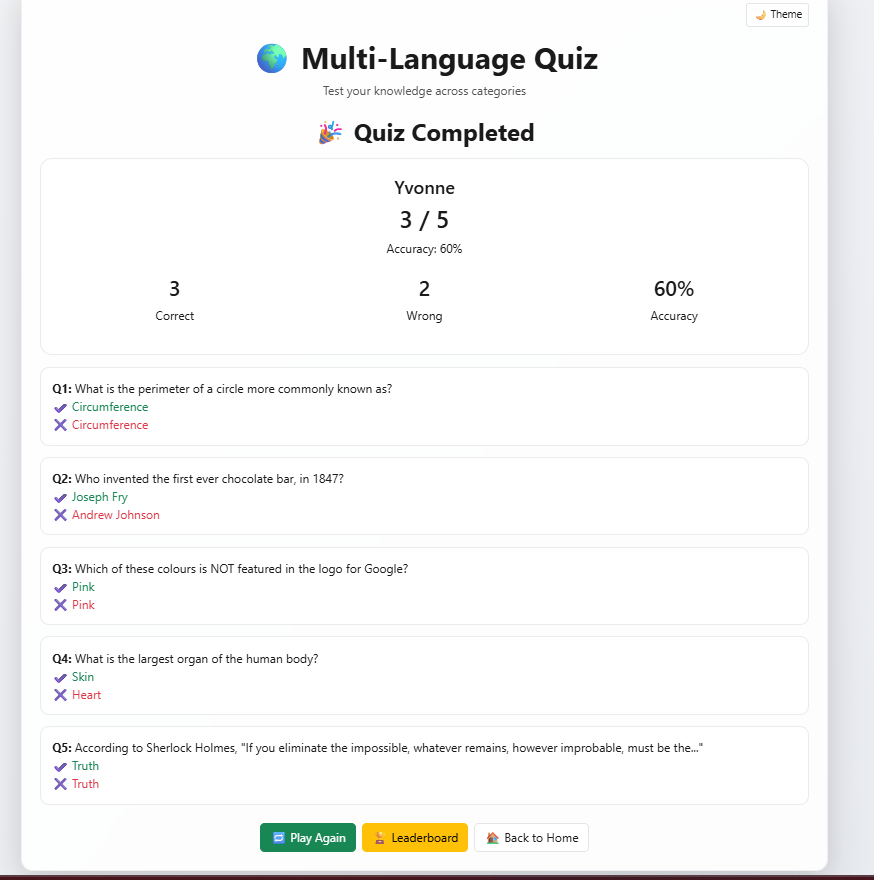

Multi-Language Quiz - Results - Spanish

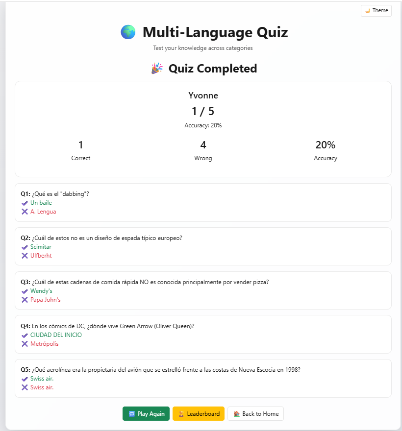

Multi-Language Quiz - Leaderboard Layout

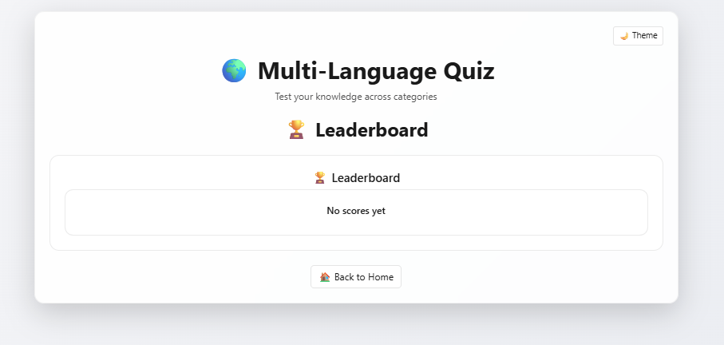

Multi-Language Quiz - Leaderboard Example

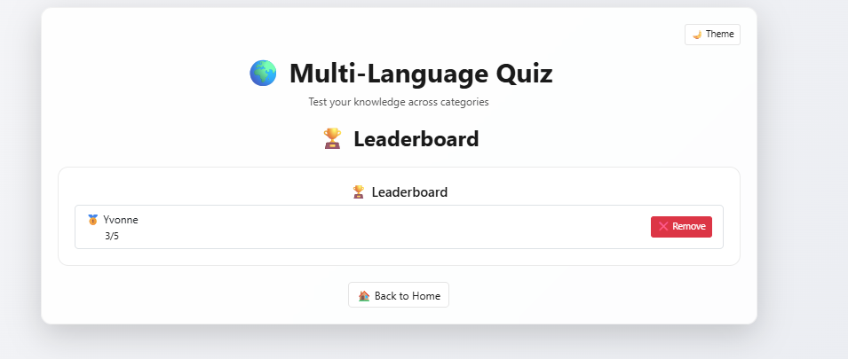

## 🗺️ Roadmap (Planned Features)
Game Mechanics
* 15-second countdown timer per question ✅
* Auto-move when time runs out ✅
* Pause / Resume functionality ✅
* Progress bar + question tracker ✅

Lifelines & Assistance
* 50/50 lifeline (removes two incorrect answers) ✅
* Instant feedback (correct / wrong) ✅
* Toast notifications for actions and alerts ✅

## 🚀 Upcoming Features
Scoring & Leaderboard
* Final score + accuracy calculation ✅
* Answer review system (correct vs selected answers) ✅
* Persistent leaderboard using LocalStorage ✅
* Top 10 high scores tracking ✅
* Option to remove leaderboard entries ✅

## 🧠 Advanced Features (Professional Level)
UI / UX Features
* Dark / Light mode toggle (saved in LocalStorage) ✅
* Glassmorphism UI design ✅
* Smooth page transitions ✅
* Confetti animation on correct answers 🎉 ✅
* Responsive mobile-first layout ✅
* Bootstrap modal welcome screen ✅

## 🧠 Challenges & Learnings
🚧 Challenges Faced
1. Managing application state without frameworks
2. Synchronizing timer, questions, and UI updates
3. Handling asynchronous API calls (quiz + translation)
4. Designing a reusable scoring and analytics system
5. Implementing persistent leaderboard logic
6. Ensuring smooth UX across page transitions

📚 Key Learnings
1. Stronger understanding of vanilla JavaScript architecture
2. Working with external APIs (OpenTDB + Translation API)
3. Improved async/await and jQuery AJAX handling
4. Building UI state management without frameworks
5. LocalStorage-based persistence strategies
6. Designing interactive quiz logic from scratch

## 👥 Credit
Designed and developed by Yvonne Adedeji.

## 📜 License
This project is open-source. For licensing details, please refer to the LICENSE file in the repository.

## 📬 Contact
You can reach me at 📧 yvonneadedeji.sarah@gmail.com.